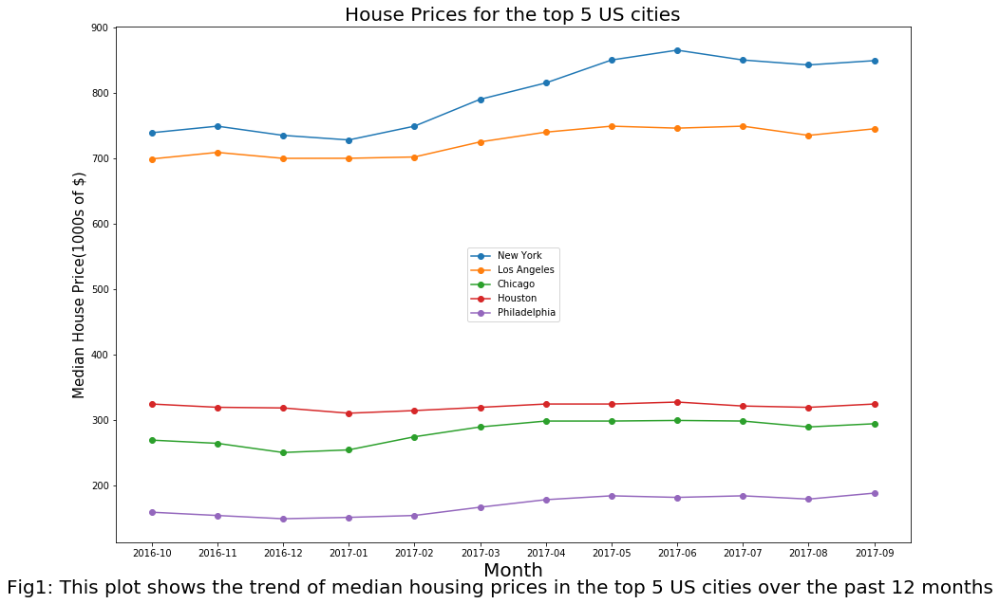

# Plot review

__Plot:__ House Prices for the top 5 US cities  
__Author:__ Srikanth Namuduri (sn2495)  
__Reviewer__ Michael Sampson (mms911)

Srikanth's plot contains all the basic yet important features of a good plot.
It contains a clear, descriptive title, axis labels with units where necessary, a well placed legend,
and a caption explaining what the plot is showing.

Moving on to the content of the plot, Srikanth chose lines to represent price over time, a good choice.
Time flows naturally from left to right and lines are a good way to show changes in the outcome of interest
over progression of time on the x-axis. The colors of the lines are vibrant and the markers help show where
the discrete values are on the x-axis. Simple yet distinct colors on a white background help contrast the different cities.
However the one big draw back of the colors Srikanth chose is that the red and green lines are very difficult to distinguish
for people who are red-green color blind (tested using Color Oracle - Deuteranopia). One way to make up for this is to perhaps
have different marker shapes for each line.

The legend, while well placed, could benefit from slightly large font. This is true for both 
the x-axis and y-axis text as well. The axis titles dwarf the axis values yet it is the values that should
take precedent.

Lastly, it would help to know how the cities were chosen. The plot is of the "top 5 cities" but how are they ranked? Are they the top five most populous cities? Or the cities with the top five housing prices? The code shows that the first 5 rows for the data set were chosen

> `df1 = df.iloc[:5]`

but does that mean the dataset was already sorted by some attribute? Upon checking the code we see that the dataset was read in pre-sorted by `SizeRank`. But even that leaves the quesiton of what "size" means. Population? Geography?

Good plot overall.

